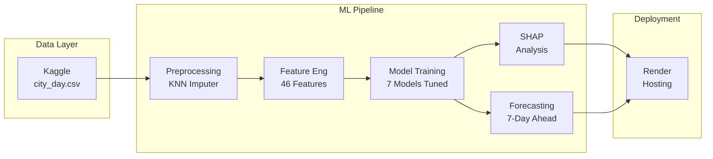

# AQI Prediction — Full ML Pipeline

A comprehensive machine learning system that predicts the Air Quality Index (AQI) from pollutant concentrations across **26 Indian cities** (2015–2020). Includes per-city analysis, SHAP interpretability, lag-based forecasting, an interactive Streamlit dashboard, and an automated retraining pipeline.

Live Demo : https://sahityabiswas.github.io/AEROMETRIC/

## Architecture



## Results

| Model | R² | RMSE | MAE |
|---|---|---|---|
| **Random Forest (Tuned)** | **0.9425** | **21.60** | **12.70** |
| LightGBM (Tuned) | 0.9389 | 22.26 | 13.09 |
| CatBoost (Tuned) | 0.9372 | 22.57 | 13.20 |
| XGBoost (Tuned) | 0.9367 | 22.66 | 13.69 |
| Lasso (α=1.0) | 0.8788 | 31.36 | 19.50 |
| Ridge (α=10.0) | 0.8514 | 34.72 | 18.44 |
| Linear Regression | 0.8451 | 35.44 | 18.49 |
| **Forecast Model (XGBoost)** | **0.9407** | **21.93** | **12.58** |

**City-specific vs Global:** Global model better for **22/26** cities.

## Quick Start

```bash
pip install -r requirements.txt

# Option 1: Run the full pipeline
jupyter notebook notebooks/AQI_full_pipeline.ipynb

# Option 2: Launch dashboard
streamlit run dashboard/app.py

# Option 3: Retrain from scratch
python scripts/retrain.py
```

## Repository Structure

```
AQI_ML_PROJECT/
├── data/
│   └── raw/
│       └── city_day.csv           # Kaggle dataset (29,531 rows, 26 cities)
├── notebooks/
│   └── AQI_full_pipeline.ipynb    # Master notebook — 7 phases
├── dashboard/
│   └── app.py                     # Streamlit dashboard (3 tabs)
├── scripts/
│   └── retrain.py                 # End-to-end retraining pipeline
├── models/                        # Trained artifacts
├── docs/
│   ├── index.html                 # GitHub Pages → redirects to dashboard
│   └── figures/                   # EDA + SHAP visualizations
└── requirements.txt
```

## Saved Artifacts

| File | Description |
|---|---|
| `models/best_model.pkl` | Champion: Random Forest (16 MB, compressed) |
| `models/forecast_model.pkl` | Forecast: XGBoost (lag-only) |
| `models/scaler.pkl` | StandardScaler for features |
| `models/city_encoder.pkl` | City → mean AQI map |
| `models/feature_columns.pkl` | 46 feature column names |
| `models/city_shap_analysis.pkl` | Per-city top pollutants |
| `data/processed/train.csv` | Training set (chronological 80%) |
| `data/processed/test.csv` | Test set (chronological 20%) |

## Live Deployment

| Service | URL |
|---|---|
| **Dashboard** | [https://ml-based-aqi-prediction.onrender.com](https://ml-based-aqi-prediction.onrender.com) |
| **GitHub Repo** | [https://github.com/Sahityabiswas/ML_BASED_AQI_PREDICTION](https://github.com/Sahityabiswas/ML_BASED_AQI_PREDICTION) |

## Dataset

Kaggle: [Air Quality Data in India (2015–2020)](https://www.kaggle.com/datasets/rohanrao/air-quality-data-in-india)
